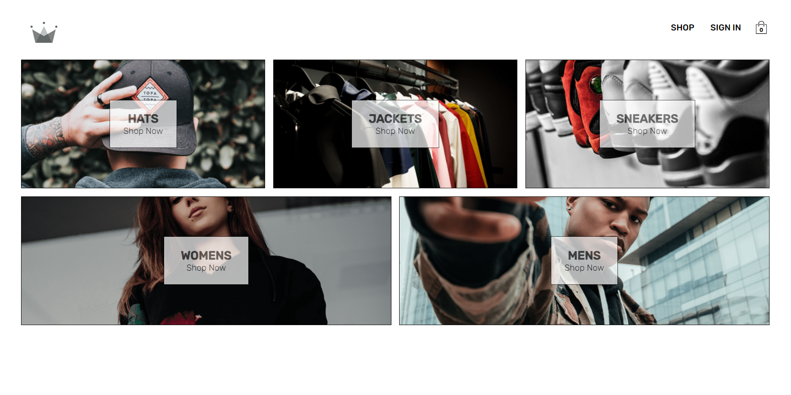

# Crown Clothing

Learn using **Typescript**, **Redux Saga**, **Redux Toolkit**, **GraphQL**, **Apollo**, **Firebase** in authentication,... in React.

Live: [**https://react-crown-clothing-nhattm.netlify.app/**](https://react-crown-clothing-nhattm.netlify.app/)

## ⚓ Environment

- Node 19.3.0

## 🚀 Technologies Used

- react 18.2.x
- typescript 5.0.x
- redux-saga 1.2.x
- firebase 9.17.x
- stripe 11.15.x
- graphql 16.6.x
- @apollo/client 3.7.x

## 📖 References

Learned from a [**Complete React Developer in 2023 (w/ Redux, Hooks, GraphQL)**](https://www.udemy.com/course/complete-react-developer-zero-to-mastery) in an Udemy course.
